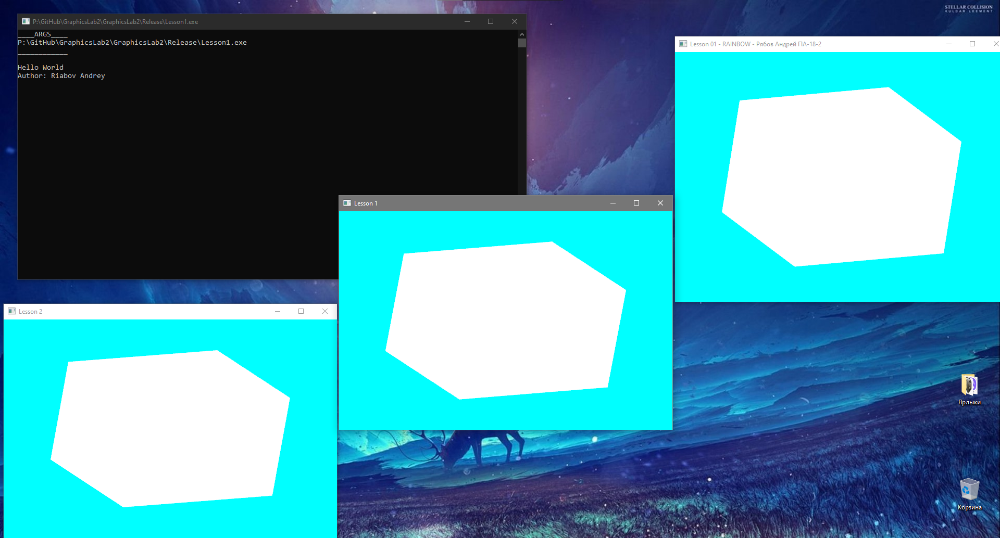
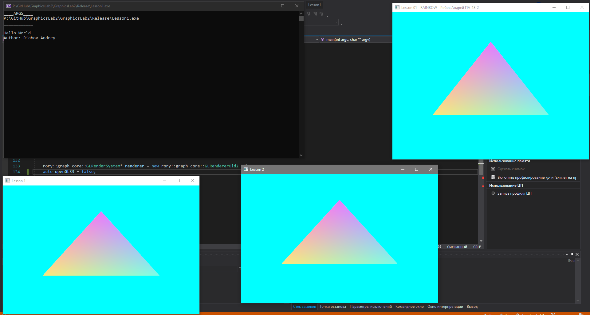

# GraphicsLab2
 
# Отчёт по лабораторной работе 2 по Графике GraphicsLab1<br>студента группы ПА-18-2<br>Рябова Андрея Дмитриевича

## Завдання
1. Створіть своє унікальне ім'я двигуна OpenGL - як абревіатуру вашого імені.
Наприклад GSC - Григорович Сергій Константинович [(GSC Game World)](https://en.wikipedia.org/wiki/GSC_Game_World)
```
namespace GSC{
}
```
2. Використовуючи шаблон програми Task02Src [https://github.com/KnightDanila/GraphicProjects_OpenGL_Shaders_GLSL/tree/master/Lesson2/Task02Src] - запишіть та запустіть код з вашим простором імен.
3. Використовуйте діаграму UML для довідки:
! [UML] (data / UML_Main1.jpg)
4. Додайте вихід до консолі:
```
Завдання 2
Автор: Вася Пупкін
```
5. Створіть 3 вікна за допомогою класу GLWindow
6. Намалюйте об'єкт VBO (без текстури)
7. Намалюйте простий масив точок glDrawArrays()
8. Покажіть, що ви можете використовувати дві рендерні машини GLRender () та GLRendererOld2_1 ().
## Выполнение:
**Main.cpp**
```
#include <iostream>
#include <windows.h>
#include <cmath>
#include <numbers>


#include "libs\GL_AL\glew.h"


#include "libs\GL_AL\glfw3.h"
#include "libs\GL_AL\glm\glm.hpp"
#include "libs\GL_AL\glm\gtc\matrix_transform.hpp"
#include "libs\GL_AL\shader.h"


#define GLUT_DISABLE_ATEXIT_HACK
#include "libs\GL_AL\glew.h"
#include "libs\GL_AL\glfw3.h"
#include <iso646.h>


namespace Cube {
    float vertices[] = {
        -0.5f, -0.5f, -0.5f, 0.0f, 0.0f,
        0.5f, -0.5f, -0.5f, 1.0f, 0.0f,
        0.5f, 0.5f, -0.5f, 1.0f, 1.0f,
        0.5f, 0.5f, -0.5f, 1.0f, 1.0f,
        -0.5f, 0.5f, -0.5f, 0.0f, 1.0f,
        -0.5f, -0.5f, -0.5f, 0.0f, 0.0f,


        -0.5f, -0.5f, 0.5f, 0.0f, 0.0f,
        0.5f, -0.5f, 0.5f, 1.0f, 0.0f,
        0.5f, 0.5f, 0.5f, 1.0f, 1.0f,
        0.5f, 0.5f, 0.5f, 1.0f, 1.0f,
        -0.5f, 0.5f, 0.5f, 0.0f, 1.0f,
        -0.5f, -0.5f, 0.5f, 0.0f, 0.0f,


        -0.5f, 0.5f, 0.5f, 1.0f, 0.0f,
        -0.5f, 0.5f, -0.5f, 1.0f, 1.0f,
        -0.5f, -0.5f, -0.5f, 0.0f, 1.0f,
        -0.5f, -0.5f, -0.5f, 0.0f, 1.0f,
        -0.5f, -0.5f, 0.5f, 0.0f, 0.0f,
        -0.5f, 0.5f, 0.5f, 1.0f, 0.0f,


        0.5f, 0.5f, 0.5f, 1.0f, 0.0f,
        0.5f, 0.5f, -0.5f, 1.0f, 1.0f,
        0.5f, -0.5f, -0.5f, 0.0f, 1.0f,
        0.5f, -0.5f, -0.5f, 0.0f, 1.0f,
        0.5f, -0.5f, 0.5f, 0.0f, 0.0f,
        0.5f, 0.5f, 0.5f, 1.0f, 0.0f,


        -0.5f, -0.5f, -0.5f, 0.0f, 1.0f,
        0.5f, -0.5f, -0.5f, 1.0f, 1.0f,
        0.5f, -0.5f, 0.5f, 1.0f, 0.0f,
        0.5f, -0.5f, 0.5f, 1.0f, 0.0f,
        -0.5f, -0.5f, 0.5f, 0.0f, 0.0f,
        -0.5f, -0.5f, -0.5f, 0.0f, 1.0f,


        -0.5f, 0.5f, -0.5f, 0.0f, 1.0f,
        0.5f, 0.5f, -0.5f, 1.0f, 1.0f,
        0.5f, 0.5f, 0.5f, 1.0f, 0.0f,
        0.5f, 0.5f, 0.5f, 1.0f, 0.0f,
        -0.5f, 0.5f, 0.5f, 0.0f, 0.0f,
        -0.5f, 0.5f, -0.5f, 0.0f, 1.0f
    };
    // world space positions of our cubes
    glm::vec3 cubePositions[] = {
        glm::vec3(0.0f, 0.0f, 0.0f),
        glm::vec3(2.0f, 5.0f, -15.0f),
        glm::vec3(-1.5f, -2.2f, -2.5f),
        glm::vec3(-3.8f, -2.0f, -12.3f),
        glm::vec3(2.4f, -0.4f, -3.5f),
        glm::vec3(-1.7f, 3.0f, -7.5f),
        glm::vec3(1.3f, -2.0f, -2.5f),
        glm::vec3(1.5f, 2.0f, -2.5f),
        glm::vec3(1.5f, 0.2f, -1.5f),
        glm::vec3(-1.3f, 1.0f, -1.5f)
    };
    unsigned int VBO;
    unsigned int VAO;
    unsigned int texture1;
    unsigned int texture2;
    Shader ourShader;


    void init() {


        {
            glGenBuffers(1, &VBO);
            glBindBuffer(GL_ARRAY_BUFFER, VBO);
            glBufferData(GL_ARRAY_BUFFER, sizeof(vertices), vertices, GL_STATIC_DRAW);


            // position attribute
            //glVertexAttribPointer(0, 3, GL_FLOAT, GL_FALSE, 5 * sizeof (float), (void*) 0);
            //glEnableVertexAttribArray(0);
            // texture coord attribute
            //glVertexAttribPointer(1, 2, GL_FLOAT, GL_FALSE, 5 * sizeof (float), (void*) (3 * sizeof (float)));
            //glEnableVertexAttribArray(1);
        }
    }


}

#include "GLRenderSystem.h"
#include "GLWindow.h";
using namespace std;

template< typename T >
void println(T i) {
	cout << i << endl;
}

void argsEcho(int argc, char** argv) {
	println("____ARGS____");
	if (argc == 0) {
		println("NO ARGS");
	}
	else {
		for (int i = 0; i < argc; i++) {
			println(argv[i]);
		}
	}
	println("____________\n");
}
int main(int argc, char** argv) {

	argsEcho(argc, argv);
	println("Hello World\nAuthor: Riabov Andrey");
	if (!glfwInit()) {
		fprintf(stderr, "Ошибка при инициализации GLFW\n");
		return -1;
	}


	rory::graph_core::GLRenderSystem* renderer = new rory::graph_core::GLRendererOld2_1();
	auto openGL33 = true;
	if (openGL33) {
		renderer = new rory::graph_core::GLRender();
	}
	else {
		renderer = new rory::graph_core::GLRendererOld2_1();
	}
	renderer->init();

	auto win1 = new rory::GLWindow("Lesson 1", 640, 420);
	auto win2 = new rory::GLWindow("Lesson 2", 640, 420);


	auto window = glfwCreateWindow(640, 480, "Lesson 01 - RAINBOW - Рябов Андрей ПА-18-2", nullptr, nullptr);

	if (!window) {
		fprintf(
			stderr,
			"Невозможно открыть окно GLFW. Если у вас Intel GPU, то он не поддерживает версию 3.3. Попробуйте версию уроков для OpenGL 2.1.\n");
		glfwTerminate();
		return -1;
	}

	glfwMakeContextCurrent(window);
	glewExperimental = true;
	if (glewInit() != GLEW_OK) {
		fprintf(stderr, "Невозможно инициализировать GLEW\n");
		return -1;
	}

	glfwSetInputMode(window, GLFW_STICKY_KEYS, GL_TRUE);

	while (glfwGetKey(window, GLFW_KEY_ESCAPE) != GLFW_PRESS && glfwWindowShouldClose(window) == 0) {
		glfwMakeContextCurrent(win1->get_glfw_handle());
		renderer->render(win1->get_glfw_handle());
		glfwSwapBuffers(win1->get_glfw_handle());
		glfwMakeContextCurrent(win2->get_glfw_handle());
		renderer->render(win2->get_glfw_handle());
		glfwSwapBuffers(win2->get_glfw_handle());
		glfwPollEvents();
		glfwMakeContextCurrent(window);
		renderer->render(window);
		glfwSwapBuffers(window);
		glfwPollEvents();
	}

	glfwTerminate();
	return 0;
}

```
**GLRenderSystem.h**
```
#ifndef GLRENDERSYSTEM_H
#define GLRENDERSYSTEM_H

#include "libs\GL_AL\glew.h"
#include "libs\GL_AL\glfw3.h"

#include <cstdio>

namespace rory {
	namespace graph_core {
		class GLRenderSystem {
		public:
			virtual ~GLRenderSystem() = default;
			virtual void init() { }
			virtual void render(GLFWwindow* window) { }
			virtual void renderTriangleArray(GLfloat vertices[], GLfloat colors[]) { }
			virtual void renderVBO() { }
		};

		class GLRender final: public GLRenderSystem {
			void init() override {
				if (!glfwInit()) {
					fprintf(stderr, "Ошибка при инициализации GLFW\n");
					return;
				}
				glfwWindowHint(GLFW_SAMPLES, 4);
				glfwWindowHint(GLFW_CONTEXT_VERSION_MAJOR, 3);
				glfwWindowHint(GLFW_CONTEXT_VERSION_MINOR, 0);
				/*glfwWindowHint(GLFW_OPENGL_FORWARD_COMPAT, GL_TRUE);*/
			}
			void render(GLFWwindow* window) override {
				float colorRGB = 0.0;
				glClearColor(sin(colorRGB * std::numbers::pi / 180), abs(cos(colorRGB * std::numbers::pi / 180)), abs(sin(colorRGB * std::numbers::pi / 180) + cos(colorRGB * std::numbers::pi / 180)), 1.0f);
				glClear(GL_COLOR_BUFFER_BIT | GL_DEPTH_BUFFER_BIT);
				colorRGB <= 180 ? colorRGB += 0.1 : colorRGB = 0;
				glEnable(GL_DEPTH_TEST);
				glMatrixMode(GL_MODELVIEW);
				glPushMatrix();
				glRotatef(glfwGetTime() * 50.0f, 1.0, 1.0, 0.0); //apply transformation
				glGenBuffers(1, &Cube::VBO);
				glBindBuffer(GL_ARRAY_BUFFER, Cube::VBO);
				glBufferData(GL_ARRAY_BUFFER, sizeof(Cube::vertices), Cube::vertices, GL_STATIC_DRAW);
				glVertexPointer(3, GL_FLOAT, 0, nullptr);
				glBindBuffer(GL_ARRAY_BUFFER, Cube::VBO);
				glVertexAttribPointer(0, 3, GL_FLOAT, GL_FALSE, 5 * sizeof(float), static_cast<void*>(nullptr));
				glEnableVertexAttribArray(0);
				glEnableClientState(GL_VERTEX_ARRAY);
				glDrawArrays(GL_TRIANGLES, 0, sizeof(Cube::vertices) / sizeof(Cube::vertices[0] / 5));
				glPopMatrix();
				glDisableClientState(GL_VERTEX_ARRAY);
			}
			void renderTriangleArray(GLfloat vertices[], GLfloat colors[]) override { }
		};

		class GLRendererOld2_1: public GLRenderSystem {
			void init() override {
				if (!glfwInit()) {
					fprintf(stderr, "Ошибка при инициализации GLFW\n");
					return;
				}
				glfwWindowHint(GLFW_SAMPLES, 4);
				glfwWindowHint(GLFW_CONTEXT_VERSION_MAJOR, 2);
				glfwWindowHint(GLFW_CONTEXT_VERSION_MINOR, 1);
			}

			void render(GLFWwindow* window) override {
				float colorRGB = 0.0;
				glClearColor(sin(colorRGB * std::numbers::pi / 180), abs(cos(colorRGB * std::numbers::pi / 180)),
				             abs(sin(colorRGB * std::numbers::pi / 180) + cos(colorRGB * std::numbers::pi / 180)),
				             1.0f);
				glClear(GL_COLOR_BUFFER_BIT);
				{
					colorRGB <= 180 ? colorRGB += 0.1 : colorRGB = 0;
				}
				glLoadIdentity();
				glRotatef(static_cast<float>(glfwGetTime()) * 50.f, 0.f, 1.f, 0.f);
				glBegin(GL_TRIANGLES);
				///*glColor3f(sin(static_cast<float>(glfwGetTime())*5), 0.f, 0.f);*/
				//glColor3f((sin(glfwGetTime() / 2) + 1) / 2, (sin(glfwGetTime() / 2 + 1.5) + 1) / 2, (sin(glfwGetTime() / 2 + 1.0) + 1) / 2);
				//glVertex3f(-0.6f, -0.4f, 0.f);
				///*glColor3f(0.f, sin(static_cast<float>(glfwGetTime()) * 5), 0.f);*/
				//glColor3f((sin(glfwGetTime() / 2) + 1) / 2, (sin(glfwGetTime() / 2 + 1.5) + 1) / 2, (sin(glfwGetTime() / 2 + 1.0) + 1) / 2);
				//glVertex3f(0.6f, -0.4f, 0.f);
				///*glColor3f(0.f, 0.f, sin(static_cast<float>(glfwGetTime()) * 5));*/
				//glColor3f((sin(glfwGetTime() / 2) + 1) / 2, (sin(glfwGetTime() / 2 + 1.5) + 1) / 2, (sin(glfwGetTime() / 2 + 1.0) + 1) / 2);
				//glVertex3f(0.f, 0.6f, 0.f);
				glColor3f((sin(glfwGetTime() / 2) + 1) / 2, (sin(glfwGetTime() / 2 + 1.5) + 1) / 2,
				          (sin(glfwGetTime() / 2 + 1.0) + 1) / 2);
				glVertex3f(-0.6f, -0.4f, 0.f);
				glColor3f((sin(glfwGetTime() / 2 + 1.5) + 1) / 2, (sin(glfwGetTime() / 2 + 1.0) + 1) / 2,
				          (sin(glfwGetTime() / 2) + 1) / 2);
				glVertex3f(0.6f, -0.4f, 0.f);
				glColor3f((sin(glfwGetTime() / 2 + 1.0) + 1) / 2, (sin(glfwGetTime() / 2) + 1) / 2,
				          (sin(glfwGetTime() / 2 + 1.5) + 1) / 2);
				glVertex3f(0.f, 0.6f, 0.f);
				glEnd();
			}

			void renderTriangleArray(GLfloat vertices[], GLfloat colors[]) override {
				glClear(GL_COLOR_BUFFER_BIT);
				glEnableClientState(GL_VERTEX_ARRAY);
				glEnableClientState(GL_COLOR_ARRAY);
				glVertexPointer(3, GL_FLOAT, 0, vertices);
				glColorPointer(3, GL_FLOAT, 0, colors);
				glDrawArrays(GL_QUADS, 0, 8);
				glDisableClientState(GL_COLOR_ARRAY);
				glDisableClientState(GL_VERTEX_ARRAY);
			}
		};
	}
}

#endif

```
**GLWindow.h**
```
#ifndef GLWINDOW_H
#define GLWINDOW_H

#include "libs\GL_AL\glew.h"
#include "libs\GL_AL\glfw3.h"

namespace rory {
	class GLWindow {
	public:
		GLWindow(const std::string& title, uint32_t width, uint32_t height) : GLWindow(title, width, height, nullptr) {}

		GLWindow(const std::string& title, uint32_t width, uint32_t height, GLFWwindow* share) {
			this->window_ = glfwCreateWindow(width, height, title.c_str(), nullptr, share);
		}
		~GLWindow() {
			glfwSetWindowShouldClose(this->window_, 1);
		};
		[[nodiscard]] uint32_t get_width() const {
			int* width = nullptr;
			int* height = nullptr;
			glfwGetWindowSize(this->window_, width, height);
			return *width;
		};
		[[nodiscard]] uint32_t get_height() const {
			int* width = nullptr;
			int* height = nullptr;
			glfwGetWindowSize(this->window_, width, height);
			return *height;
		};
		[[nodiscard]] GLFWwindow* get_glfw_handle() const {
			return this->window_;
		};
	private:
		GLFWwindow* window_;
	};
}
#endif GLWINDOW_H 
```
## Работа программы:



## Вывод:

Я ознакомился с особенностями работы библиотеки OpenGL.
Библиотека позволяет при помощи простых функций работать с визуальными возможностями окна. Сделал простую заготовку с выводом текста в консоль и изменением названия окна. Программа - заготовка *RAINBOW* от [DanillaKnight](https://github.com/KnightDanila).
 
